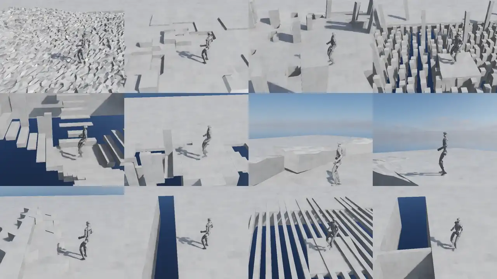

# Minimal AME-2 extension of IsaacLab



Website: https://sites.google.com/leggedrobotics.com/ame-2  
Result Video: https://www.youtube.com/watch?v=FNA1crvtBLs  
Author: Chong Zhang (chozhang@ethz.ch or chong.zhang@ai.ethz.ch)

Please cite if you find this codebase or our paper useful:
```bibtex
@article{zhang2026agile,
  title   = {Agile and Generalized Legged Locomotion via Attention-Based Neural Map Encoding},
  author  = {Zhang, Chong and Klemm, Victor and Yang, Fan and Hutter, Marco},
  journal = {IEEE Transactions on Robotics},
  year    = {2026}
}
```

The codebase is mostly vibecoded, and many IsaacLab know-hows are from Mayank Mittal. Thanks AI and Mayank! 

> **Vibe4Vibe:** the fastest way to get into this codebase is a coding agent.

> **No feature contribution:** It shall be half-archived as a reference to a finished work.


## Setup

+ Isaac Lab 2.3.2 (Isaac Sim 5.1)
+ rsl_rl: bundled in `rsl_rl/`
+ install via container (from the repo root, needs Docker + NVIDIA Container Toolkit):
  ```bash
  ./container/build.sh                                                        # build ame2-minimal:latest
  ./container/run.sh -g 0 train --task Ame2-G1-Gaze --num_envs 4096           # single-GPU training
  ./container/run.sh -g 0,1 train --task Ame2-G1-Gaze --num_envs 4096         # multi-GPU (torchrun)
  ./container/run.sh -g 0 --gui play --task Ame2-G1-Gaze-Play --checkpoint <path/to/model.pt>
  ./container/run.sh shell                                                    # interactive shell
  ./container/run.sh -d shell                                                 # background container to exec into
  ./container/run.sh exec [NAME]                                              # bash into a running container (default: newest)
  ```


## Current features:
- G1 teacher training (AME-2, optional TAGA-style active gaze, multi-headed PPO, bf16 optimization, muon optimizer)
- ~~Neural Mapping in the loop (Mid360 lidar) -- *unavailable until the next paper release happening soon (the mapping model is not included)*~~
- ~~G1 student training (LSIO + AME-2, distilled + RL from a teacher JIT) -- *unavailable until the next paper release (requires the neural mapping model)*~~

- Optional new features:
    - torso, arm, and foot shaping for humanoids, not tuned. The original paper only covers legs.

## Existing checkpoints and logs:
- Check `modelzoo/`. Will add new runs in the future.

## Release Plans:
- Lidar Neural Map checkpoint
- Tron1 Env and Depth Neural Map
- Neural Map Training Code

## Notes:
- Some trivial details might not be perfectly aligned between IsaacLab and legged gym. Some might be improved.
- The results for humanoids do not represent the limits of our method (contributions mostly on generalization and neural mapping) -- there is no targetted performance tuning or style optimization, especially for G1.
- MDP setup shall easily transfer to other robots.

## License

© 2026 ETH Zurich  
Created by: Chong Zhang, Victor Klemm, Fan Yang, and Marco Hutter  
Licensed under the GNU General Public License v3.0 (see [LICENSE](LICENSE)).

Third-party code keeps its original license (see [licenses/dependencies](licenses/dependencies)):
- `rsl_rl/` is a modified copy of [rsl_rl](https://github.com/leggedrobotics/rsl_rl), BSD-3-Clause.
- Files in `ame2/` marked "The Isaac Lab Project Developers" are derived from [Isaac Lab](https://github.com/isaac-sim/IsaacLab), BSD-3-Clause. Isaac Lab itself is not included.
- `ame2/ame2/sensors/mid360_raydirs.npy` (Livox Mid-360 scan pattern) comes from [fratopa/Mid360_simulation_plugin](https://github.com/fratopa/Mid360_simulation_plugin).

